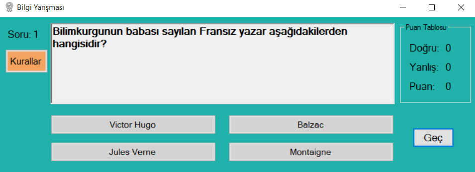
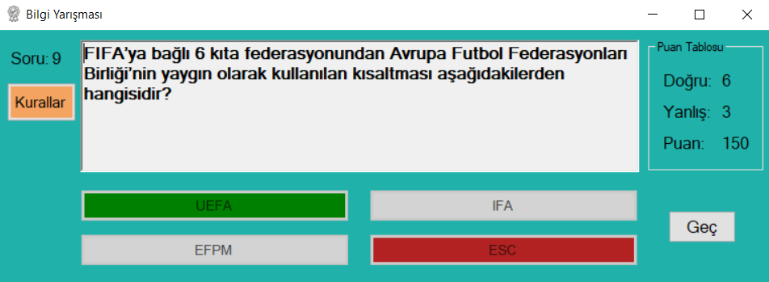
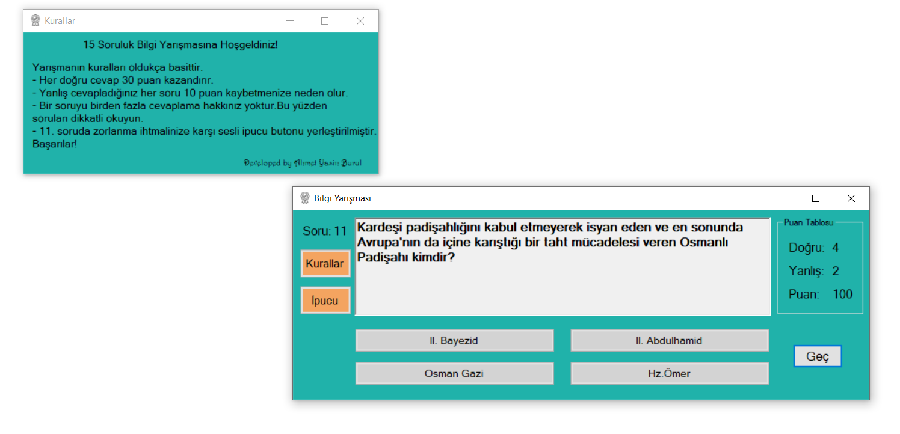

 
# :book: Veritabansız Bilgi Yarışması
Yaklaşık 400 satır kodla geliştirilmiş 15 soruluk bir bilgi yarışması.
Veritabansız bilgi yarışması 15 sorudan oluşan bir genel kültür testinden oluşmaktadır. 
Projenin kaynak kodları ve setup dosyası mevcuttur.
Her doğru veya yanlış cevap için uygun ses efekti kullanılmıştır. Aynı zamanda 11. soruya özel sesli ipucu bulunmaktadır.

### Kullanılan Kütüphaneler:

⇒ Windows Forms

⇒ Media 

⇒ Drawing 

### Kullanılan Araçlar

⇒ Form

⇒ Label

⇒ Button

⇒ RichTextBox

⇒ GroupBox

### Form Sayısı

2

### Çalıştırılabilir Kod Satırı Sayısı

523

### Setup Dosyası

[Bilgi Yarışması Setup](https://github.com/ahmetbrl38/Veritabansiz-Bilgi-Yarismasi/raw/master/Setup/BilgiYarismasiSetup.msi)

### Ekran Görüntüleri

